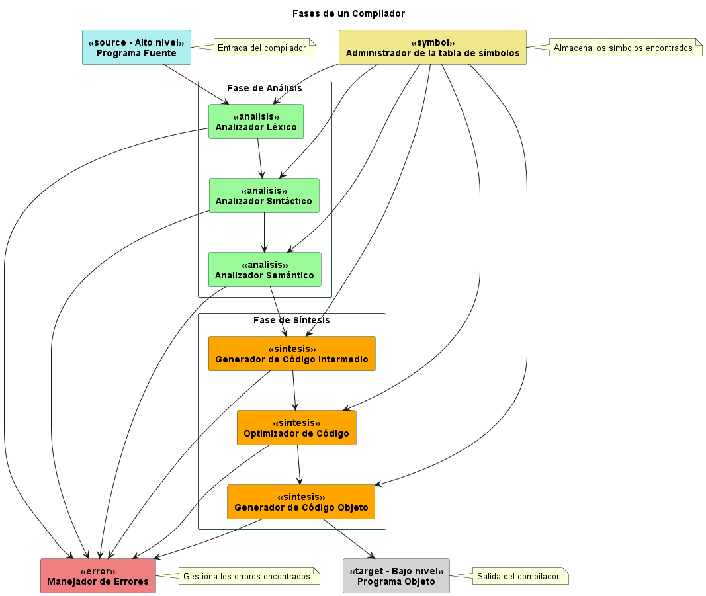

# Fase de Análisis (El Frontend del Compilador)

La fase de análisis, también conocida como frontend del compilador, es el punto de partida donde el código fuente es sometido a un exhaustivo escrutinio léxico, sintáctico y semántico. Esta fase da lugar a la creación de una representación intermedia del programa fuente y a la construcción de la tabla de símbolos, que servirán como entrada para la fase de síntesis.

## Subfases de Análisis

### 1. Análisis Léxico

El análisis léxico, la primera subfase del frontend, se encarga de garantizar que todas las palabras del código se ajusten al alfabeto del lenguaje y estén definidas dentro del mismo. Aquí, el código fuente se descompone en unidades léxicas llamadas tokens, que representan las entidades básicas del lenguaje de programación.

### 2. Análisis Sintáctico

El análisis sintáctico verifica que cada estructura del código respete las reglas gramaticales del lenguaje, asegurando que tenga un sentido estructuralmente correcto. Este proceso se encarga de construir la estructura jerárquica del programa, utilizando la secuencia de tokens generada por el análisis léxico.

### 3. Análisis Semántico

El análisis semántico se adentra en el significado del código, verificando que las construcciones del programa tengan coherencia semántica. Se asegura de que las variables estén correctamente declaradas, que los tipos de datos sean compatibles y que las operaciones tengan sentido en el contexto del programa.
