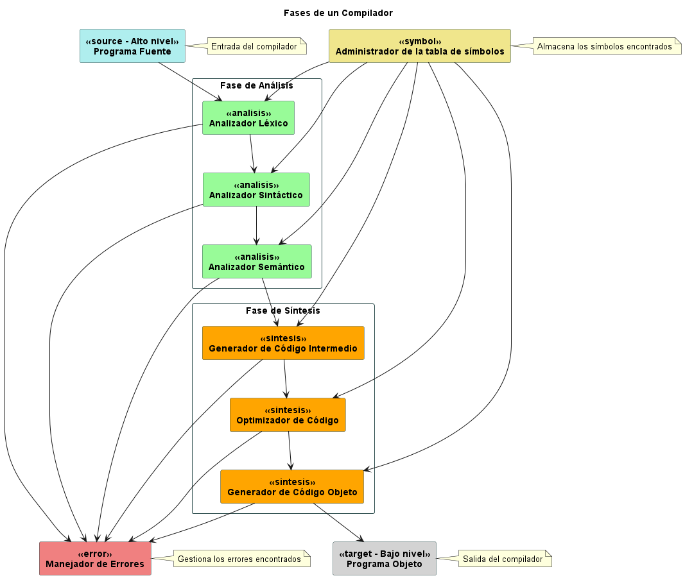

# Fase de Síntesis (El Backend del Compilador)

La fase de síntesis, también conocida como backend del compilador, es donde se genera el programa destino a partir del código fuente, su representación intermedia y la tabla de símbolos obtenida en la fase de análisis.

## Subfases de Síntesis

### 1. Generación de Código Intermedio

En esta subfase, se recibe la representación intermedia del programa y se transforma en una forma más abstracta y fácil de optimizar. El código intermedio tiende a ser independiente de la máquina objetivo y facilita las etapas posteriores de optimización y generación de código objeto.

### 2. Optimización de Código

La optimización de código se encarga de mejorar la representación intermedia del programa para que sea más eficiente en términos de tiempo de ejecución y consumo de recursos. Transforma fragmentos de código en otros equivalentes pero más eficientes, utilizando técnicas como la eliminación de código redundante o la reorganización de operaciones.

### 3. Generación de Código Objeto

En la fase final, el generador de código objeto traduce la representación intermedia del programa en código ejecutable para la máquina objetivo. Este código objeto es el resultado final del proceso de compilación y puede ser ejecutado directamente por la computadora.