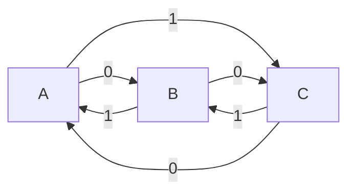

# Autómatas

## Introducción a los Autómatas

Los autómatas son modelos abstractos de sistemas computacionales que pueden procesar entradas de manera controlada. Están compuestos por un conjunto finito de estados y una función de transición que define cómo el autómata cambia de un estado a otro en respuesta a las entradas.

---

## Autómatas Finitos Deterministas (DFA)

Los Autómatas Finitos Deterministas (DFA) son un tipo específico de autómata caracterizado por tener un conjunto finito de estados, una única transición definida para cada estado y símbolo de entrada, y la capacidad de determinar de manera única su próximo estado.

### Definición y Características

Un DFA se define formalmente como una tupla $(Q, \Sigma, \delta, q_0, F)$, donde:
- $Q$ es un conjunto finito de estados.
- $\Sigma$ es un conjunto finito de símbolos de entrada (alfabeto).
- $\delta$ es la función de transición, que mapea un estado y un símbolo de entrada a un estado.
- $q_0$ es el estado inicial.
- $F$ es un conjunto de estados finales o de aceptación.

### Estados, Estado Inicial, Estados Finales

Los estados representan las diferentes situaciones en las que puede encontrarse el autómata durante su procesamiento. El estado inicial es el estado en el que el autómata comienza su ejecución, mientras que los estados finales son aquellos en los que el autómata finaliza su procesamiento y reconoce una cadena como válida.

### Tabla y Diagrama de un Autómata Finito

Para representar la función de transición de un DFA, se utiliza comúnmente una tabla que muestra para cada estado y símbolo de entrada, el estado al que transita el autómata. También es común representar un DFA mediante un diagrama de estados, donde los nodos representan los estados y las aristas representan las transiciones entre ellos.

| Estado |   0   |   1   |
|--------|-------|-------|
|   A    |   B   |   C   |
|   B    |   C   |   A   |
|   C    |   A   |   B   |

---

## Lenguaje Reconocido por un Autómata Finito Determinista

El lenguaje reconocido por un DFA es el conjunto de todas las cadenas que, al ser procesadas por el autómata, conducen a un estado final. El proceso de reconocimiento de cadenas por parte de un DFA implica seguir la función de transición del autómata secuencialmente para cada símbolo de la cadena de entrada, comenzando desde el estado inicial.

### Definición del Lenguaje Reconocido

El lenguaje reconocido por un DFA se define como el conjunto de todas las cadenas que llevan al autómata desde su estado inicial a un estado final.

### Proceso de Reconocimiento de Cadenas

Para reconocer una cadena dada, se inicia en el estado inicial del DFA y se sigue la función de transición para cada símbolo de la cadena. Si al finalizar la cadena el autómata se encuentra en un estado final, la cadena es reconocida; de lo contrario, la cadena es rechazada.

Esta versión incluye tablas para representar la función de transición y diagramas de estados utilizando Mermaid, lo que hace que el contenido sea más visualmente atractivo y fácil de entender para los lectores.